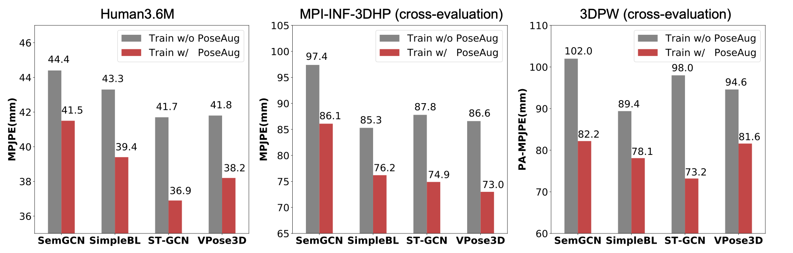

[](https://paperswithcode.com/sota/weakly-supervised-3d-human-pose-estimation-on?p=paper/poseaug-a-differentiable-pose-augmentation)
[](https://paperswithcode.com/sota/monocular-3d-human-pose-estimation-on-human3?p=poseaug-a-differentiable-pose-augmentation)
[](https://paperswithcode.com/sota/3d-human-pose-estimation-on-human36m?p=poseaug-a-differentiable-pose-augmentation)
[](https://paperswithcode.com/sota/3d-human-pose-estimation-on-mpi-inf-3dhp?p=poseaug-a-differentiable-pose-augmentation)


# PoseAug: A Differentiable Pose Augmentation Framework for 3D Human Pose Estimation
Code repository for the paper:  
**PoseAug: A Differentiable Pose Augmentation Framework for 3D Human Pose Estimation**  
[Kehong Gong](https://www.ece.nus.edu.sg/lv/index.html)\*, [Jianfeng Zhang](https://jeff95.me/)\*, [Jiashi Feng](https://sites.google.com/site/jshfeng/)  
CVPR 2021 (oral presentation)  
[[paper](https://arxiv.org/pdf/2105.02465.pdf)] [[project page (coming soon)](https://jeff95.me/)]



<table style="border:0px">
   <tr>
       <td></td>
       <td></td>
   </tr>
</table>

<table style="border:0px">
   <tr>
       <td></td>
   </tr>
</table>


## Installation
The experiments are conducted on Ubuntu 16.04, with Python version 3.6.9, and PyTorch version 1.0.1.post2.

To setup the environment:
```sh
cd PoseAug
conda create -n poseaug python=3.6.9
conda activate poseaug
pip install -r requirements.txt
```

## Prepare dataset
* Please refer to [`DATASETS.md`](./DATASETS.md) for the preparation of the dataset files. 

## Run training code  
* There are 32 experiments in total (16 for baseline training, 16 for PoseAug training), 
including four pose estimators ([SemGCN](https://github.com/garyzhao/SemGCN), [SimpleBaseline](https://github.com/una-dinosauria/3d-pose-baseline), [ST-GCN](https://github.com/vanoracai/Exploiting-Spatial-temporal-Relationships-for-3D-Pose-Estimation-via-Graph-Convolutional-Networks), [VideoPose](https://github.com/facebookresearch/VideoPose3D))
and four 2D pose settings (Ground Truth, CPN, DET, HR-Net).
* The training procedure contains two steps: pretrain the baseline models and then train these baseline models with PoseAug.
* We also provide pretrained baseline and poseaug models ([link](https://drive.google.com/drive/folders/1mLttbyZxsRdN5kw1IRdzZozyfndhV3Wh)) for further training and evaluation.

To pretrain the baseline model, 
```sh
# gcn
python3 run_baseline.py --note pretrain --dropout 0 --lr 2e-2 --epochs 100 --posenet_name 'gcn' --checkpoint './checkpoint/pretrain_baseline' --keypoints gt
python3 run_baseline.py --note pretrain --dropout 0 --lr 2e-2 --epochs 100 --posenet_name 'gcn' --checkpoint './checkpoint/pretrain_baseline' --keypoints cpn_ft_h36m_dbb
python3 run_baseline.py --note pretrain --dropout 0 --lr 2e-2 --epochs 100 --posenet_name 'gcn' --checkpoint './checkpoint/pretrain_baseline' --keypoints detectron_ft_h36m
python3 run_baseline.py --note pretrain --dropout 0 --lr 2e-2 --epochs 100 --posenet_name 'gcn' --checkpoint './checkpoint/pretrain_baseline' --keypoints hr

# videopose
python3 run_baseline.py --note pretrain --lr 1e-3 --posenet_name 'videopose' --checkpoint './checkpoint/pretrain_baseline' --keypoints gt
python3 run_baseline.py --note pretrain --lr 1e-3 --posenet_name 'videopose' --checkpoint './checkpoint/pretrain_baseline' --keypoints cpn_ft_h36m_dbb
python3 run_baseline.py --note pretrain --lr 1e-3 --posenet_name 'videopose' --checkpoint './checkpoint/pretrain_baseline' --keypoints detectron_ft_h36m
python3 run_baseline.py --note pretrain --lr 1e-3 --posenet_name 'videopose' --checkpoint './checkpoint/pretrain_baseline' --keypoints hr

# mlp
python3 run_baseline.py --note pretrain --lr 1e-3 --stages 2 --posenet_name 'mlp' --checkpoint './checkpoint/pretrain_baseline' --keypoints gt
python3 run_baseline.py --note pretrain --lr 1e-3 --stages 2 --posenet_name 'mlp' --checkpoint './checkpoint/pretrain_baseline' --keypoints cpn_ft_h36m_dbb
python3 run_baseline.py --note pretrain --lr 1e-3 --stages 2 --posenet_name 'mlp' --checkpoint './checkpoint/pretrain_baseline' --keypoints detectron_ft_h36m
python3 run_baseline.py --note pretrain --lr 1e-3 --stages 2 --posenet_name 'mlp' --checkpoint './checkpoint/pretrain_baseline' --keypoints hr

# st-gcn
python3 run_baseline.py --note pretrain --dropout -1 --lr 1e-3 --posenet_name 'stgcn' --checkpoint './checkpoint/pretrain_baseline' --keypoints gt
python3 run_baseline.py --note pretrain --dropout -1 --lr 1e-3 --posenet_name 'stgcn' --checkpoint './checkpoint/pretrain_baseline' --keypoints cpn_ft_h36m_dbb
python3 run_baseline.py --note pretrain --dropout -1 --lr 1e-3 --posenet_name 'stgcn' --checkpoint './checkpoint/pretrain_baseline' --keypoints detectron_ft_h36m
python3 run_baseline.py --note pretrain --dropout -1 --lr 1e-3 --posenet_name 'stgcn' --checkpoint './checkpoint/pretrain_baseline' --keypoints hr
# Note: for st-gcn, dropout is set to -1, representing the default dropout setting used in the original code (different layers using different dropout values).

```
To train the baseline model with PoseAug:
```sh
# gcn
python3 run_poseaug.py --note poseaug --dropout 0 --posenet_name 'gcn' --lr_p 1e-3 --checkpoint './checkpoint/poseaug' --keypoints gt
python3 run_poseaug.py --note poseaug --dropout 0 --posenet_name 'gcn' --lr_p 1e-3 --checkpoint './checkpoint/poseaug' --keypoints cpn_ft_h36m_dbb
python3 run_poseaug.py --note poseaug --dropout 0 --posenet_name 'gcn' --lr_p 1e-3 --checkpoint './checkpoint/poseaug' --keypoints detectron_ft_h36m
python3 run_poseaug.py --note poseaug --dropout 0 --posenet_name 'gcn' --lr_p 1e-3 --checkpoint './checkpoint/poseaug' --keypoints hr

# video
python3 run_poseaug.py --note poseaug --posenet_name 'videopose' --lr_p 1e-4 --checkpoint './checkpoint/poseaug' --keypoints gt
python3 run_poseaug.py --note poseaug --posenet_name 'videopose' --lr_p 1e-4 --checkpoint './checkpoint/poseaug' --keypoints cpn_ft_h36m_dbb
python3 run_poseaug.py --note poseaug --posenet_name 'videopose' --lr_p 1e-4 --checkpoint './checkpoint/poseaug' --keypoints detectron_ft_h36m
python3 run_poseaug.py --note poseaug --posenet_name 'videopose' --lr_p 1e-4 --checkpoint './checkpoint/poseaug' --keypoints hr

# mlp
python3 run_poseaug.py --note poseaug --posenet_name 'mlp' --lr_p 1e-4 --stages 2 --checkpoint './checkpoint/poseaug' --keypoints gt
python3 run_poseaug.py --note poseaug --posenet_name 'mlp' --lr_p 1e-4 --stages 2 --checkpoint './checkpoint/poseaug' --keypoints cpn_ft_h36m_dbb
python3 run_poseaug.py --note poseaug --posenet_name 'mlp' --lr_p 1e-4 --stages 2 --checkpoint './checkpoint/poseaug' --keypoints detectron_ft_h36m
python3 run_poseaug.py --note poseaug --posenet_name 'mlp' --lr_p 1e-4 --stages 2 --checkpoint './checkpoint/poseaug' --keypoints hr

# st-gcn
python3 run_poseaug.py --note poseaug --dropout 0 --posenet_name 'stgcn' --lr_p 1e-4 --checkpoint './checkpoint/poseaug' --keypoints gt
python3 run_poseaug.py --note poseaug --dropout 0 --posenet_name 'stgcn' --lr_p 1e-4 --checkpoint './checkpoint/poseaug' --keypoints cpn_ft_h36m_dbb
python3 run_poseaug.py --note poseaug --dropout 0 --posenet_name 'stgcn' --lr_p 1e-4 --checkpoint './checkpoint/poseaug' --keypoints detectron_ft_h36m
python3 run_poseaug.py --note poseaug --dropout 0 --posenet_name 'stgcn' --lr_p 1e-4 --checkpoint './checkpoint/poseaug' --keypoints hr

```
All the checkpoints, evaluation results and logs will be saved to `./checkpoint`. You can use tensorboard to monitor the training process:
```sh
cd ./checkpoint/poseaug
tensorboard --logdir=/path/to/eventfile
```

### Comment:
* For simplicity, hyper-param for different 2D pose settings are the same. If you want to explore better performance for specific setting, please try changing the hyper-param. 
* The GAN training may collapse, change the hyper-param (e.g., random_seed) and re-train the models will solve the problem.


## Run evaluation code
```sh
python3 run_evaluate.py --posenet_name 'videopose' --keypoints gt --evaluate '/path/to/checkpoint'
```
We provide a [`checkpoint/PoseAug_result_summary.ipynb`](./checkpoint/PoseAug_result_summary.ipynb), which can generate the result summary table for all 16 experiments.

## Run inference code
We provide an inference code [here](https://github.com/Garfield-kh/PoseTriplet/tree/main/estimator_inference). Please follow the instruction and download PoseAug's pretrained model for inference on images/videos.

## Citation
If you  find this code useful for your research, please consider citing the following paper:

    @inproceedings{gong2021poseaug,
      title       = {PoseAug: A Differentiable Pose Augmentation Framework for 3D Human Pose Estimation},
      author      = {Gong, Kehong and Zhang, Jianfeng and Feng, Jiashi},
      booktitle   = {CVPR},
      year        = {2021}
    }

## Acknowledgements
This code uses [SemGCN](https://github.com/garyzhao/SemGCN), [SimpleBL](https://github.com/una-dinosauria/3d-pose-baseline), [ST-GCN](https://github.com/vanoracai/Exploiting-Spatial-temporal-Relationships-for-3D-Pose-Estimation-via-Graph-Convolutional-Networks) and [VPose3D](https://github.com/facebookresearch/VideoPose3D) as backbone. We gratefully appreciate the impact these libraries had on our work. If you use our code, please consider citing the original papers as well.
